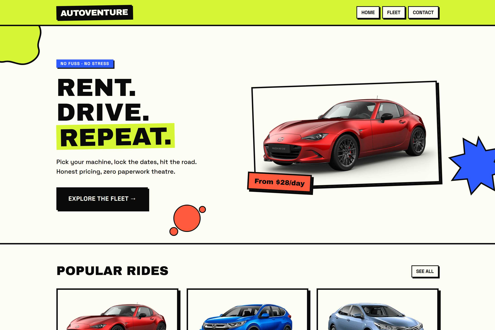
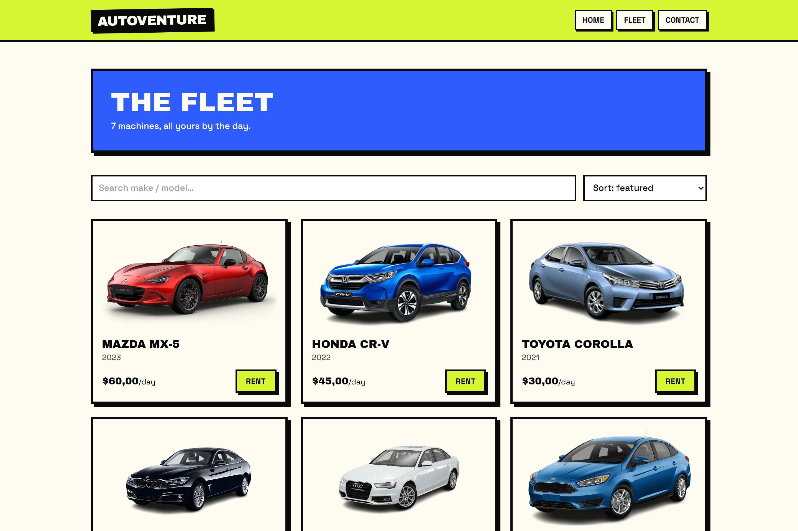
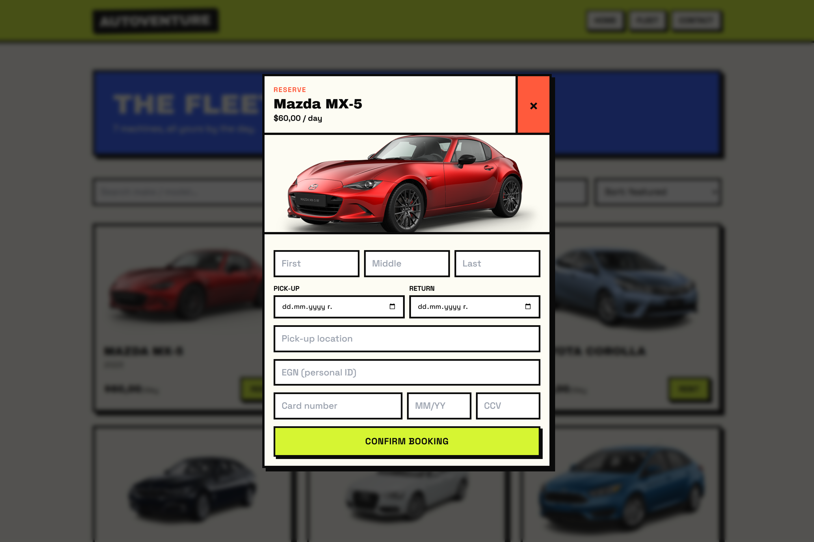
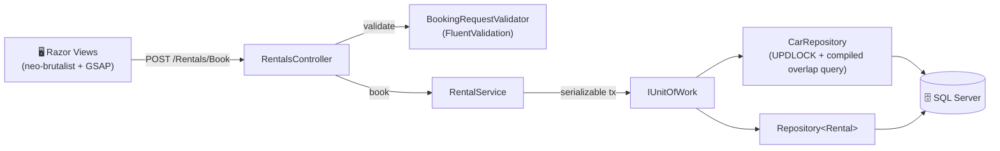

<div align="center">

# 🏎️ AutoVenture

### Rent. Drive. Repeat.

**A neo-brutalist car-rental platform built on .NET 9 — race-condition-proof bookings, a cinematic UI, and graffiti-energy motion.**

<br/>


</div>

---

<div align="center">
  
</div>

---

## ✨ Why AutoVenture

This isn't another CRUD scaffold with a Bootstrap coat of paint. It pairs a **hardened, concurrency-safe booking core** with a **loud, hand-built neo-brutalist front-end** — and every claim below is verified against a live database, not hand-waved.

| | |
|---|---|
| 🔒 **No double-bookings, ever** | A serializable transaction + pessimistic `UPDLOCK` on the chassis row makes *check-availability → reserve* a single atomic step. |
| ⚡ **Compiled hot path** | The availability/overlap query is an `EF.CompileAsyncQuery` — cached SQL translation on every booking. |
| 🛡️ **Real validation** | FluentValidation: rental-date order, 90-day cap, **age ≥ 21 derived from a checksum-validated Bulgarian EGN**, Luhn card check, expiry & CCV. |
| 🎨 **Neo-brutalist by hand** | 4px ink borders, hard offset shadows, acid/cobalt/flare palette, Archivo Black display type. |
| 💥 **Graffiti motion** | GSAP entrance reveals, Flip-powered filter shuffle, and paint-splat bursts on every booking. |
| 🖼️ **Modern assets** | Conditional `<picture>`/WebP pipeline, lazy-loading, and CLS-safe dimensions. |

---

## 📸 Screens

<table>
  <tr>
    <td width="50%"></td>
    <td width="50%"></td>
  </tr>
  <tr>
    <td align="center"><b>The Fleet</b> — DB-driven grid with live search &amp; sort (GSAP Flip shuffle)</td>
    <td align="center"><b>Booking</b> — glass-backdrop modal posting a validated <code>BookingRequest</code></td>
  </tr>
</table>

---

## 🧱 Architecture

A pragmatic Clean-ish layering: controllers stay thin, the **service layer owns the booking invariant**, and the **Unit of Work owns the transaction boundary**.



**The double-booking guard, step by step:**

```
BeginSerializableTransaction
        │
        ▼
GetForUpdateAsync(carId)   ── SELECT ... WITH (UPDLOCK, HOLDLOCK)   ← concurrent request blocks here
        │
        ▼
IsAvailableAsync(car, start, end)   ── compiled overlap query
        │
        ├─ overlap found ─────────────►  409  "already booked"
        │
        ▼
Add(rental) → SaveChanges → Commit  ─►  200  { rentalId, total }
```

---

## 🛠️ Tech Stack

| Layer | Choice |
|-------|--------|
| **Runtime** | .NET 9 · ASP.NET Core MVC |
| **Data** | EF Core 9 · SQL Server LocalDB · Repository + Unit of Work · compiled queries · RowVersion |
| **Validation** | FluentValidation 11 (DI-resolved, explicitly invoked) |
| **Styling** | Tailwind CSS · custom neo-brutalist design tokens · `brutal.css` primitives |
| **Motion** | GSAP 3 + Flip plugin · graceful no-JS / reduced-motion fallbacks |
| **Assets** | `<picture>`/WebP pipeline · lazy-load · CLS-safe sizing |

---

## 🚀 Getting Started

### Prerequisites
- [.NET 9 SDK](https://dotnet.microsoft.com/download)
- SQL Server **LocalDB** (ships with Visual Studio / the SQL Server Express installer)

### Run it

```bash
git clone https://github.com/TedoNeObichaJavaScript/AutoVenture.git
cd AutoVenture

# applies migrations + seeds 7 cars automatically on first boot
dotnet run --project AutoVenture
```

Then open **https://localhost:5001** (or the URL printed in the console). The database (`CarRentalDB`) is created, migrated, and seeded on startup.

### Optional — activate WebP imagery

```powershell
winget install Google.libwebp      # one-time: installs the cwebp encoder
pwsh tools/encode-webp.ps1          # generates carsphoto/webp/*.webp
```

The `_CarImage` partial detects the encoded files and serves WebP automatically — no markup changes needed.

---

## 🔌 Booking API

`POST /Rentals/Book` — `Content-Type: application/json`

```jsonc
{
  "carId": 1,
  "firstName": "Ivan", "middleName": "G", "lastName": "Petrov",
  "startDate": "2026-07-01", "endDate": "2026-07-04",
  "egn": "9005150000", "pickupSite": "Sofia",
  "creditCard": "4242424242424242", "expirationDate": "12/30", "ccv": "123"
}
```

| Status | Meaning |
|--------|---------|
| `200 OK` | `{ rentalId, total, message }` |
| `400 Bad Request` | Validation failed — `{ message, errors[] }` |
| `404 Not Found` | Unknown car |
| `409 Conflict` | Car already booked for those dates (or lost a concurrency race) |

**Validation rules:** start ≥ today · end > start · window ≤ 90 days · driver age ≥ 21 (from EGN) · Luhn-valid card · non-expired `MM/YY` · 3–4 digit CCV.

---

## 📁 Project Structure

```
AutoVenture/
├── Controllers/        Cars · Rentals · Home · Contact
├── Models/             Car · Rental · ApplicationDbContext · DbInitializer · view models
├── Data/               IRepository · Repository · CarRepository · IUnitOfWork · UnitOfWork
├── Services/           IRentalService · RentalService · BookingRequest · BookingResult
├── Validation/         BookingRequestValidator · BulgarianEgn
├── Migrations/         EF Core migrations
├── Views/              Razor views (neo-brutalist) + _BookingModal / _CarImage partials
└── wwwroot/            brutal.css · site.js (GSAP) · carsphoto/ · images/
tools/
└── encode-webp.ps1     WebP asset encoder
docs/
└── screenshots/        README imagery
```

---

## 🗺️ Roadmap

- [ ] Identity-based accounts & rental history
- [ ] Stripe payment integration (replace the demo card capture)
- [ ] Admin dashboard with fleet utilisation analytics
- [ ] Pagination / server-side filtering as the fleet grows
- [ ] Pre-rendered WebP/AVIF in CI

---

<div align="center">

**Built with .NET 9, a lot of black borders, and zero compiler warnings.**

<sub>© 2026 AutoVenture — Drive something loud.</sub>

</div>
