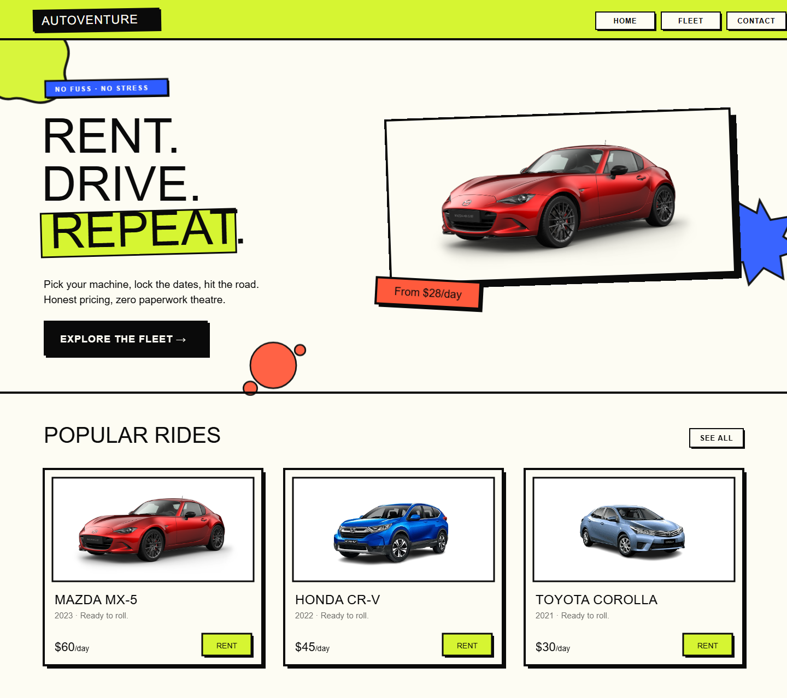

# 🎨 AutoVenture — Figma / Design Kit

A layered, editable recreation of the AutoVenture homepage, plus the design
tokens behind the neo-brutalist system.

> **Why an SVG and not a `.fig`?** Figma's file format is proprietary/binary and
> its public REST API is **read-only** for file content — there is no supported
> way to generate a native `.fig` programmatically. Figma *does* import SVG as
> fully-editable vector layers, so `autoventure-home.svg` is the real,
> round-trippable design source.

## Import into Figma

**Option A — drag & drop (fastest)**
1. Open Figma → a new design file.
2. Drag `autoventure-home.svg` onto the canvas (or **File ▸ Place image**).
3. It lands as a `Frame-AutoVenture-Home` group with named sub-layers
   (`header`, `hero`, `headline`, `hero-car-card`, `popular-rides`, `card-*`,
   `deco-splats`, …). Right-click ▸ **Ungroup** as needed to edit.

**Option B — pixel-perfect from the live site**
Use the free **html.to.design** plugin → paste a deployed URL (or use its HTML
paste mode with the running app). It rebuilds the DOM as native Figma layers,
including auto-layout — closer to production, but needs the site reachable.

## Fonts

Install these (Google Fonts, free) so the text renders as designed; otherwise
Figma substitutes a default:
- **Archivo Black** — display / headlines
- **Space Grotesk** — body, labels, UI

## Design Tokens

### Colors
| Token | Hex | Use |
|-------|-----|-----|
| `ink` | `#0a0a0a` | borders, text, primary buttons |
| `paper` | `#fdfcf3` | page & card background |
| `acid` | `#d6f532` | header, primary CTAs, highlights |
| `cobalt` | `#2f5cff` | secondary accents, tags |
| `flare` | `#ff5a3c` | alerts, price flags, close buttons |
| `white` | `#ffffff` | image plates |

### Typography
| Style | Font | Size | Weight |
|-------|------|------|--------|
| Display / Hero | Archivo Black | 88px | 400 (black) |
| Section heading | Archivo Black | 40px | 400 |
| Card title | Archivo Black | 24px | 400 |
| Body | Space Grotesk | 19px | 500 |
| Label / nav | Space Grotesk | 12–14px | 700, +1–2 letter-spacing, UPPERCASE |

### Effects (neo-brutalist)
| Token | Value |
|-------|-------|
| Border | `4px solid #0a0a0a` (3px on small elements) |
| Shadow `brutalSm` | `3px 3px 0 0 #0a0a0a` |
| Shadow `brutal` | `6px 6px 0 0 #0a0a0a` |
| Shadow `brutalLg` | `12px 12px 0 0 #0a0a0a` |
| Radius | `0` (hard edges) |
| Hover | translate(-2px,-2px) + grow shadow; active: translate to 0 |

> Hard shadows are a duplicated ink rectangle offset behind the element — Figma
> imports them as a separate layer you can recolor or restyle.

### Layout
- Content max-width **1440px**, gutters **80px**.
- Card grid: 3 columns, **400px** wide, **40px** gap.
